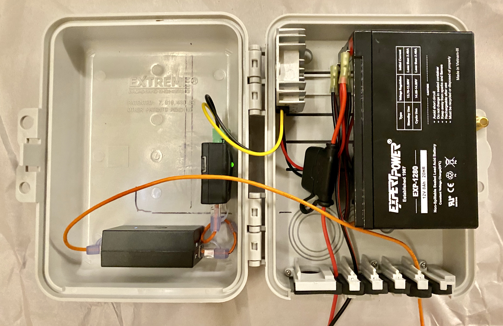

# Introduction
Welcome, and thank you for your interest in building a SFWEM Portable Access Node (PAN). Please note: 
•	This is a living document, and subject to improvement. 
•	This is not an endorsement of specific brands or resellers. It is provided for your convenience. 
•	If you have your own substitutions, tripod, power supply, what ever your imagination brings, please feel free to customize. These components are known to work allowing easy support through standardization. 

[Add a Camera to your PAN](PAN_Camera.md) 
[Add a Cisco SPA 525G to your PAN](PAN_Cisco_Phone_SPA_525G2.md) 

# Bill of Materials

|        | Component | Description |     |     |
| ------ | --------- | ----------- | --- | --- |
| Base   | WEM Radio| Ubiquiti Nanostation NSM5 |[BUY](https://www.amazon.com/dp/B00HXT8KJ4?ref=ppx_pop_mob_ap_share)|[BUY](https://www.balticnetworks.com/manufacturers/ubiquiti/ubiquiti-nanostation-m5-airmax-us-ca)|BUY|
| Base   | Battery | U12-8F | [BUY](https://www.amazon.com/APC-Battery-Replacement-BE650G1-RBC17/dp/B0002QLDLC/ref=ac_session_sims_23_2/139-1729255-5161352?_encoding=UTF8&pd_rd_i=B0002QLDLC&pd_rd_r=bbc8bd7b-29ce-418a-bc0e-0a2eabab45bb&pd_rd_w=0NRNf&pd_rd_wg=KKqOX&pf_rd_p=77a86a8c-20b5-42ee-b876-2528db9dcaf2&pf_rd_r=PWAH6TQWMP7FHSVA3X6P&psc=1&refRID=PWAH6TQWMP7FHSVA3X6P) |BUY|BUY|
| Base   | Tripod | Neewer Pro 9’ AluStudio Light Stands |[BUY](https://www.amazon.com/dp/B00UWDD0AW/ref=cm_sw_r_cp_api_i_FZnpEb2Q2FSBQ)|BUY|BUY|
| Base   | Sandbags | Neewer 8 Pack Dual Handle Sandbag |[BUY](https://www.amazon.com/gp/product/B01HM8KS72/ref=ppx_yo_dt_b_asin_title_o03_s00?ie=UTF8&psc=1)|BUY|BUY|
| Base   | Wi-Fi Radio | Ubiquiti AirGATEWAY PRO      |[BUY](https://www.amazon.com/dp/B017B00ZCO/ref=cm_sw_r_cp_api_i_PXnpEb9NNP43R)|[BUY](https://www.adorama.com/ubagproins.html?gclid=EAIaIQobChMIgJjb9t6C6AIVF9tkCh0EqgVQEAkYAiABEgIcbPD_BwE&utm_source=adl-gbase)| BUY |
| Base   | Voltage Converter | DC 12V Step Up to 24V 72W     |[BUY](https://www.amazon.com/dp/B07XBWHR56?ref=ppx_pop_mob_ap_share) | BUY | BUY |
| Base   | Case | 9X6X3 Weatherproof Enclosure      |[BUY](https://www.amazon.com/dp/B07FY224LW/ref=cm_sw_r_cp_api_i_DVnpEbDAZEAK8) | BUY | BUY |
| Base   | POE Injector |  POE Injector     |[BUY](https://www.amazon.com/dp/B005HIS408/ref=cm_sw_r_cp_api_i_20npEb9STFQNE)| BUY | BUY |
| Base   | Ethernet A | 6” Ethernet Cable     |[BUY](https://www.monoprice.com/product?p_id=29474)| BUY | BUY |
| Base   | Ethernet B | 14’ Ethernet Cable     |[BUY](https://www.monoprice.com/product?p_id=29474)| BUY | BUY |
| Base   | Terminal Conn. | Crimp on female connector    |[BUY](https://www.acehardware.com/departments/lighting-and-electrical/boxes-fittings-and-conduit/lugs/33648) | BUY | BUY |
| Base   | 3M HB Tape | High bond, two sided tape     |[BUY](https://www.acehardware.com/departments/home-and-decor/office-supplies/tape/9039587) | BUY | BUY |
| Base   | Charger | NOCO GENIUS1, 1-Amp Fully-Automatic Smart Charger |[BUY](https://www.amazon.com/gp/product/B07W46BX31/ref=ppx_od_dt_b_asin_title_s00?ie=UTF8&psc=1) | BUY |
| Option | Quick Connect | NOCO GC015 X-Connect M10 Eyelet Battery Indicator Accessory |[BUY](https://www.amazon.com/gp/product/B009MI9JMG/ref=ppx_yo_dt_b_asin_title_o04_s00?ie=UTF8&psc=1)| BUY | BUY |

Items above listed as "Option" are optional components to add features to the base model of the PAN.

# Additional Tools

PC w/ Ethernet 
Software/Firmware 
Screwdriver 
Utility knife 
Velcro+Screw 
Zip ties 
Rubbing Alcohol 

# Assembly

Instructions for assembling will appear here. 

### Voltage Converter Install

1. If your voltage converter has it's pinout described on the bottom, use a Sharpie to transcribe the pinout to the side of the converter where the wires exit the rectifier. See FIG 01.
2. Apply some rubbing alcohol to a ball of cotton, and wipe the bottom of the converter and the area of the case where the converter will be installed.
3. Apply a piece of two sided foam tape to back of converter. See FIG 02.
4. Remove liner from two sided tape, then affix converter to case as illustrated. See FIG 03.

### POE Injector Install

1. With a utility knife, cutting away from yourself, remove the eyelets from the POE Injector. See FIG 04.
2. Apply some rubbing alcohol to a ball of cotton, and wipe the bottom of the rectifier and the area of the case where the rectifier will be installed.
3. Apply a piece of two sided foam tape to back of POE Injector. See FIG 05.
4. Remove liner from two sided tape, then affix POE Injector to case as illustrated. See FIG 06.
5. Connect the 24v wires from the rectifier into the appropriate screw down connector on the POE Injector. 
  <I>PRO TIP: When connecting the feed wires, insert the wires with a little twist to encourage a slight curl to the wires.</I>

### AirGATEWAY Install

1. Remove rubber outer protective case. See FIG 07.
2. Apply some rubbing alcohol to a ball of cotton, and wipe the bottom of the rectifier and the area of the case where the rectifier will be installed.
3. Review orientation and placement of AirGATEWAY, we will install this component with the POE IN very close to the POE Injector using the short ethernet cable.
4. Apply a piece of two sided foam tape to back of rectifier. See FIG 08.
5. Remove liner from two sided tape, then affix rectifier to case as illustrated. See FIG 03.
6. Modify the short ethernet cable by carefully cutting the articulated stress relief plastic taking extra care to not damage the cable. On the cable used for this example, it was two small cuts. We did not make additional cuts to remove the unneeded material, you can if you want.

 
*Weather Resistant PAN case open showing internals.*

# Flashing and AirGateway Setup

### M5 Flash with ARDEN Firmware

More to come. Here we will link to a video on flashing the M5.

### AirGATEWAY Set-up

1. Follow instructions included with AirGATEWAY, to connect to it's web interface.
2. Key Step: Disable the airCRM Business Operations Platform Provisioning Mode by pressing the "Disable..." button.
3. In the confirmation pop-up dialogue box, press the button to confirm the change.
4. Wait about one min for the AirGATEWAY to reboot. Connect to the AirGATEWAY web admin interface again.
5. Go to the system tab and change:
  -Device name (suggestion: CALL-PANxPPPP-M5; where call is your call sign, replace the PPPP with the phone extension to be hosted at the PAN, followed by the device type identifier.)
  -Administrator Username
  -Old password
  -New password
6. Click the "Change" button.
7. Click the "Apply" button.
8. Wait about one min for the AirGATEWAY to reboot. Connect to the AirGATEWAY web admin interface again.
9. Go to the Wireless tab and change the SSID (suggestion: same as device name from above.)
10. Click the "Change" button.
11. Click the "Apply" button.
12. Wait about one min for the AirGATEWAY to reboot. Connect to the AirGATEWAY web admin using the new SSID.

Here we will link to a video on flashing the M5

v1.0 Last Updated: 27-03-2020
