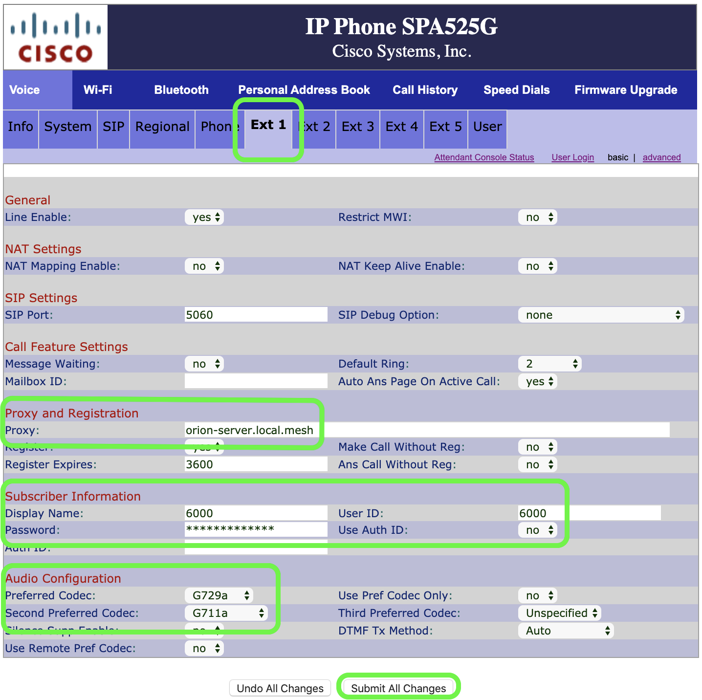

# Introduction
Welcome, and thank you for your interest in extending your SFWEM Portable Access Node (PAN) to include an IP phone. Please note: 
•	This is a living document, and subject to improvement. 
•	This is not an endorsement of specific brands or resellers. It is provided for your convenience. 
•	If you have your own substitutions, tripod, power supply, what ever your imagination brings, please feel free to customize. These components are known to work allowing easy support through standardization. 
 
 
 
# Bill of Materials

|        | Component | Description |     |     |
| ------ | --------- | ----------- | --- | --- |
| Option | Phone | Cisco SPA 525G2 |[BUY](https://www.tritondatacomonline.com/products/cisco-spa-525g2-wireless-small-business-ip-phone-spa525g2?variant=3775636868&utm_medium=cpc&utm_source=google&utm_campaign=Google%20Shopping&gclid=EAIaIQobChMIjfORiLfU5wIVE7vsCh194gP4EAQYASABEgIYN_D_BwE)| BUY | BUY |
| Option | Phone PWR Adaptor | 5V USB Pwr Cable Cisco SPA525G2 |[BUY](https://www.amazon.com/MyVolts-Power-Cable-Compatible-SPA525G2/dp/B00GC0T3LE) | BUY | BUY |
| Option | Phone Battery | USB Battery Pack | BUY | BUY | BUY |
 
 
 

# Assembly
1. Connect the USB power cable to your battery.
2. Connect the USB power(AC converter) cable to your SPA 525G.
3. Connect an ethernet cable to the "SW" port on the SPA 525G.
4. Connect the other end of the ethernet cable to the LAN port on the AirGATEWAY of your PAN.
 
 
 

# Configuration
 
## Phone Config
1. After the SPA 525G has completed the boot process, follow [these instructions](https://www.cisco.com/c/en/us/support/docs/smb/unified-communications/cisco-small-business-spa500-series-ip-phones/smb2083-determine-ip-address-on-spa525g-and-spa525g2-ip-phones.html) to get the IP address of the SPA 525G. 
2. Using a computer, connect to the wireless network of your PAN.
3. Once connected to your PAN, launch your web browser.
4. Key in the IP address from Configuration instruction #1 into the URL line of your web browser.
5. Once the phone's web based control interface loads, in the header with links and buttons, find "Admin Login" and click the link. 
 
6. Click on the "EXT 1" tab.
7. Enter these details 
   •	Proxy and Registration: Proxy: orion-server.local.mesh 
   •	Subscriber Information: Display Name: <I>Your assigned extension number</I> 
   •	Subscriber Information: User ID: <I>Your assigned extension number</I> 
   •	Subscriber Information: Password: <I>Your assigned extension password</I> 
   •	Audio Codec: Preferred Codec: <I>G729A</I> 
   •	Audio Codec: Second Preferred Codec: <I>G711A</I> 
 
8. Press the "Submit All Changes" button at the bottom of the page.
 
 
 

## Wi-Fi Config
1. Presuming you are still connected to your SPA 525G's web interface, find the "Wi-Fi" tab and click on it.
2. Find the "site survey" button and click on it.
3. A pop-up window will appear, find the SSID you gave to your AirGATEWAY. Then look to the right of the SSID and click the folder with a green plus symbol.
4. In the next pop-up window, give the profile a name in the Wi-Fi Profile Name field. (Pro Tip: enter your AirGATEWAY SSID into into this field.) When the details are correct, press the "Submit All Changes" button.
5. You should have now been returned to the Wi-Fi menu, be sure the enable check box has a green check mark. If not, click the empty checkbox to toggle it to being checked.
6. Click the "Submit All Changes" button.
7. Disconnect the power supply to the phone to power it off.
8. Disconnect the ethernet cable you connected in "Assembly" #3.
9. Reconnect the power supply to the phone, and it should join the wi-fi network of your AirGATEWAY.
10. Make a test phone call.

v1.1 Last Updated: 04-04-2020
