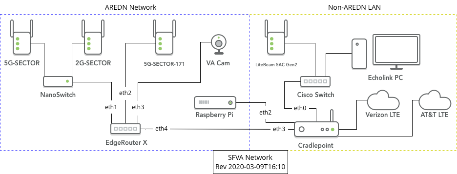

This site is sponsored by the [San Francisco Radio Club W6PW](https://www.sfarc.org/) and is located at the [SF Veterans Administration](https://www.sanfrancisco.va.gov/) campus.

# Location
San Francisco Veterans Administration Health Care System  
[4150 Clement Street  
San Francisco, CA  94121](https://www.google.com/maps/place/4150+Clement+St,+San+Francisco,+CA+94121/@37.7820107,-122.5072398,17z/data=!3m1!4b1!4m5!3m4!1s0x808587b2d099c0c5:0xad5e65c5d46b74f5!8m2!3d37.7820065!4d-122.5050511)  

* North-West corner of the San Francisco.

# Contact
Antonis Papatsaras AA6PP  
<mailto:aa6pp@aa6pp.org>  

***

# Network

The SFVA Network is broken into two logical segments:

1. **AREDN Network**: Mesh-associated and accessible nodes & services.  
    - Internet/WAN Gateway via Cradlepoint.  
    - Primary Internet provider is Comcast.net (at SUNSET).  
    - Secondary Internet provider is Sonic.net, Verizon LTE, AT&T LTE, T-Mobile LTE (at SUNSET).  
    - Secondary Internet provider is Sonic.net, Verizon LTE, AT&T LTE, T-Mobile LTE (at SFVA).  
2. **Non-AREDN LAN**: Isolated network for non-Mesh services (Echolink, WIRES-X, et al).
    - Internet/WAN Gateway via LiteBeam 5AC Gen2.  
    - Primary Internet provider is Comcast.net (at SUNSET).  
    - Secondary Internet provider is Sonic.net, Verizon LTE, AT&T LTE, T-Mobile LTE (at SUNSET).  
    - Secondary Internet provider is Sonic.net, Verizon LTE, AT&T LTE, T-Mobile LTE (at SFVA).  

The LiteBeam 5AC Gen2 at the SFVA is connectied via a 5 GHz 802.11ac link to a matching LiteBeam 5AC Gen2 at SUNSET.

# Nodes
## Roof

The following nodes are mounted on the roof of the building.

### [W6PW-SFVA-5G-SECTOR](http://W6PW-SFVA-5G-SECTOR.local.mesh)

* [Ubiquiti Rocket M5 XW](https://www.ui.com/airmax/rocketm/).
* [MikroTik mAND 19s](https://mikrotik.com/product/MTAS-5G-19D120) 19 dBi 120 Degree beamwidth antenna.
* Channel 179 (5.895 GHz)
* 24 VDC PoE from roof-mounted NanoSwitch.

### [W6PW-SFVA-5G-SECTOR-171](http://W6PW-SFVA-5G-SECTOR-171.local.mesh)

* [Ubiquiti Rocket M5](https://www.ui.com/airmax/rocketm/).
* [Ubiquiti AM-5G17-90](https://www.ui.com/airmax/airmax-sector-antenna/) 17 dBi 90 Degree beamwidth antenna.
* Channel 171 (5.855 GHz)
* 24 VDC PoE from on-site UPS AC Power.

### [W6PW-SFVA-2G-SECTOR](http://W6PW-SFVA-2G-SECTOR.local.mesh)

* [Ubiquiti Rocket M2 Xm](https://www.ui.com/airmax/rocketm/).
* [Ubiquiti AM-2G15-120](https://www.ui.com/airmax/airmax-sector-antenna/) 15 dBi 120 Degree beamwidth antenna.
* Channel -2 (2.397 GHz)
* 24 VDC PoE from roof-mounted NanoSwitch.

## Repeater Closet

The following nodes are mounted in the Repeater Closet.

### [W6PW-SFVA-ERX](http://W6PW-SFVA-ERX.local.mesh)

* Ubiquiti EdgeRouter X SFP.
* 24 VDC Power from UPS AC Power.
* Provides power to NanoSwitch on roof, which in turn powers 2G-SECTOR & 5G-SECTOR.
