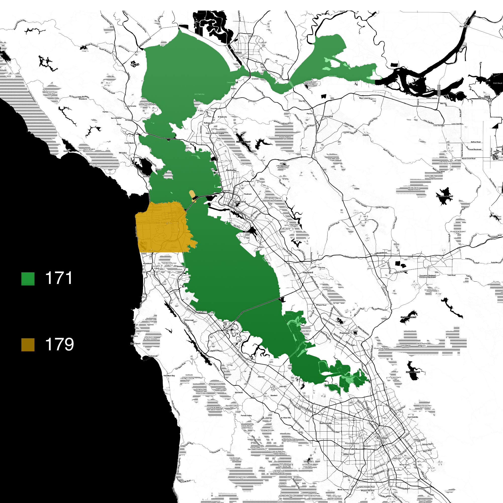

# Introduction
The Band Plan for the SFWEM serving the greater Bay Area. Please note, this is a living document, and subject to improvement as we build it out.

## Map

 

## By Frequency
171: Cross Bay links 
175: Hercules, Pinole, Pleasant Hill,  
177: Oakland 
179: San Francisco,  

## By Location

Atherton: 179 
Concord: 175 
Cross Bay: 171 
Lake Chabot: 177 
Los Altos Hills: 179 
Hercules: 175 
Pinole: 175 
Portola Valley: 179 
San Francisco: 179 
San Leandro: 177 
Treasure Island: 179 

v1.0 Last Updated: 05-04-2020
